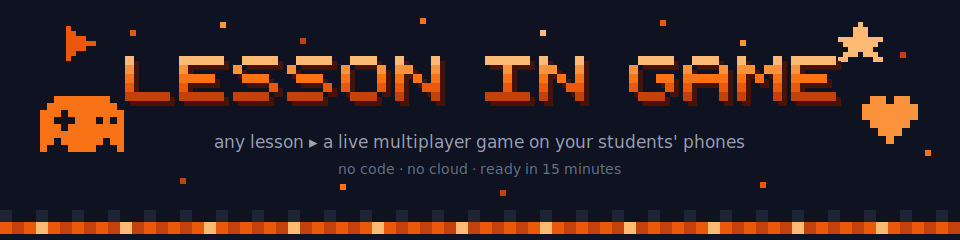
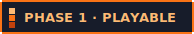
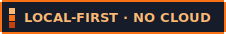
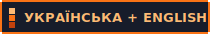
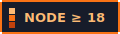
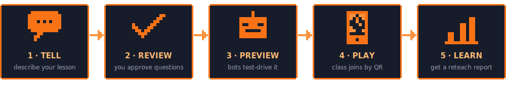

<p align="center">
  
</p>

<p align="center">
  
  
  
  
</p>

<p align="center"><em>You describe tomorrow's lesson. It becomes a game your class plays together — <br>and it quietly tells you what to reteach the next day.</em></p>

<p align="center"></p>

## 🍊 What is this?

**Lesson in Game** is a free tool for teachers of *any* subject — history, chemistry, literature, economics, anything. You describe a lesson in your own words ("my 8th-graders should be able to recall which organelle does what"), and in about fifteen minutes you get a **live multiplayer game** your whole class joins from their phones by scanning a QR code.

No coding. No accounts. No app installs. No internet needed during class — the game runs on **your laptop**, over the room's Wi-Fi, and every answer stays on your machine.

You make only the decisions you already know how to make as a teacher. All the game-design science (motivation, difficulty, fairness, inclusion) is applied for you, automatically, behind the scenes.

## 🕹 How it works

<p align="center">
  
</p>

1. **Tell** — you chat with your assistant for a few minutes: what's the topic, what should students be able to *do*, who's in the room, how much time do you have. Paste your notes or a textbook chapter.
2. **Review** — it drafts the game questions **from your material**. You're the expert: fix, reword, or reject anything. Nothing goes live until you approve it.
3. **Preview** — one command fills the room with friendly robot players so you can watch a full round before class. No surprises in front of thirty teenagers.
4. **Play** — your laptop shows a QR code on the projector. Students scan, pick a nickname, and play in teams. You steer everything from a private control panel: pause, reveal, next round, end.
5. **Learn** — the moment the game ends you get a one-page report: which concepts the class collectively missed, who is quietly struggling, and what to reteach tomorrow.

## ✨ What makes it different

- 🧠 **The game *is* the lesson.** The mechanic matches the thinking your objective demands — recall, estimation, sequencing, debate — never points bolted onto a worksheet.
- 🤫 **Nobody gets humiliated.** Wrong answers are private. The shared screen shows teams and anonymous stats — never "Maria got it wrong." Struggling students quietly receive easier scaffolding, and only you see the flags.
- 📊 **It's secretly a diagnostic.** Because the game runs on your machine, it sees every answer — and turns that into a formative-assessment report no commercial quiz tool gives you.
- 🔌 **Works offline.** School Wi-Fi blocked? A €20 travel router or your laptop's hotspot is enough. Internet is needed once, at install.
- 🧡 **Motivation science built in.** Self-Determination Theory, Flow, and meaningful-gamification research are encoded as invisible rules: every game has real choices, visible progress, teamwork, and a closing reflection moment.

## 🎒 What you need

| | |
|---|---|
| 💻 | A laptop with [Node.js](https://nodejs.org) 18+ (free) and [Claude Code](https://claude.com/claude-code) |
| 📶 | The room's Wi-Fi, a cheap travel router, or your laptop's hotspot |
| 📱 | Students' phones/tablets — any device with a browser works |

## 🚀 Quick start

```bash
git clone https://github.com/OleksiiDotsenko/lesson-in-game.git
cd lesson-in-game
node lesson-in-game/engine/setup.js     # one-time install (~1 minute, needs internet once)
```

Then open Claude Code in this folder and just talk to it like a colleague:

> *"Make a game for my 8th-grade biology lesson tomorrow — students should be able to recall which organelle performs each cell function. 24 kids, most have phones, 20 minutes. Here are my notes: …"*

It interviews you, drafts the questions, waits for your approval, and launches. Want to try it right now without writing anything? Three ready-made packs ship in [`lesson-in-game/examples/`](lesson-in-game/examples/) — including one in Ukrainian:

```bash
cp lesson-in-game/examples/*.json ~/lesson-in-game/packs/
node ~/lesson-in-game/engine/runner.js --pack cell-organelles-bio-g8 --preview   # watch bots play it
node ~/lesson-in-game/engine/runner.js --pack cell-organelles-bio-g8             # go live in class
```

## 🎮 Game modes

| Mode | Best for | Status |
|---|---|---|
| **Quiz Arena** — team quiz + estimation wagers, adaptive difficulty | facts, vocabulary, formulas, "feel for the numbers" | 🟧 **playable** |
| **Pipeline Race** — put steps & categories in order, relay-style | processes, chronologies, taxonomies | ⬜ planned |
| **Territory Conquest** — correct answers capture a shared map | geography, anatomy, history | ⬜ planned |
| **Co-op Boss Battle** — the whole class defeats a "misconception monster" | high-anxiety topics, class bonding | ⬜ planned |
| **Debate & Vote Arena** — structured positions, evidence, class vote | ethics, history, literature | ⬜ planned |
| **Simulation Sandbox** — everyone plays a role in a shared system | markets, ecosystems, epidemics | ⬜ planned |

All modes run on one engine — a new mode is a configuration, not a new app.

## 🔒 The privacy promise

Student answers **never leave the teacher's laptop**. There is no cloud, no student accounts, no tracking, and nicknames are fine. Reports are files in your home folder — yours to keep or delete. That's a design principle, not a setting.

## 🇺🇦 Коротко українською

**Lesson in Game** — безкоштовний інструмент для вчителів будь-якого предмета. Ви описуєте урок своїми словами — і за ~15 хвилин отримуєте живу командну гру, до якої клас приєднується з телефонів за QR-кодом. Без програмування, без інтернету на уроці, без акаунтів: гра працює на вашому ноутбуці, і всі відповіді учнів залишаються у вас. Після гри — готовий звіт: що клас не зрозумів і кого варто підтримати. Українська мова підтримується нарівні з англійською — спробуйте готовий приклад `systema-krovoobihu-bio-g8-uk` (кровоносна система, 8 клас).

## 🗂 What's in this repo

| Path | What it is |
|---|---|
| [`lesson-in-game/`](lesson-in-game/README.md) | The working product: 4 Claude Code skills + the game engine |
| [`lesson-in-game/examples/`](lesson-in-game/examples/) | Three ready-to-play content packs (🇬🇧 biology, 🇬🇧 economics, 🇺🇦 біологія) |
| [`lesson-to-game-engine-concept.md`](lesson-to-game-engine-concept.md) | The full concept: architecture, research framing, design principles |
| [`skill-set-plan.md`](skill-set-plan.md) | The build plan that turned the concept into this code |
| [`assets/`](assets/) | The pixel art on this page (`node assets/generate.js` regenerates it) |

## 🗺 Roadmap

- **Phase 1 — prove the loop** 🟧 *done*: interview → questions → your approval → live game → report.
- **Phase 2 — breadth + insight** ⬜: five more game modes, richer diagnostics, report feeds the next lesson automatically.
- **Phase 3 — reach every teacher** ⬜: one-click app (no terminal at all), classroom pilot, community game modes.

<p align="center"></p>

<p align="center">made with 🧡 for teachers · student data stays in the classroom · <a href="LICENSE">MIT license</a> · <a href="lesson-to-game-engine-concept.md">read the full concept</a></p>
