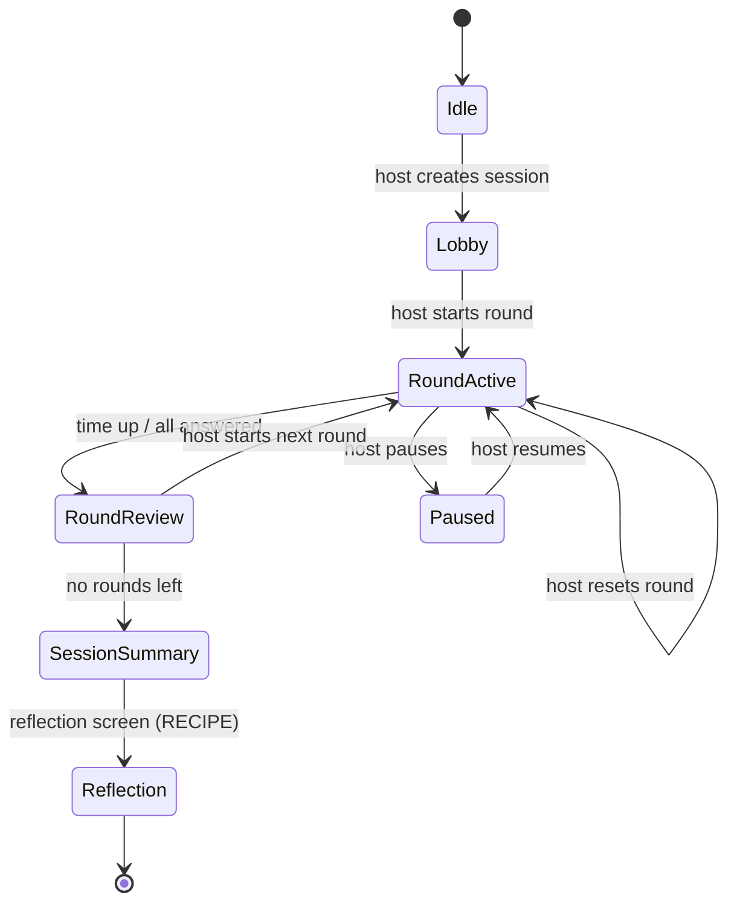

# The Lesson-to-Game Engine

### A framework-grounded skill set that lets any teacher, in any subject, turn a lesson into a live classroom game

*Working name: **Lesson in Game**. A concept document.*

---

## 1. Vision in one paragraph

An ordinary teacher — of history, chemistry, literature, economics, anything — describes tomorrow's lesson in plain pedagogical language and, in under fifteen minutes and without writing a line of code or reading a single design paper, walks away with a working multiplayer game their class can join from any browser over the room's local network. The teacher makes only decisions they already know how to make ("what should students be able to do after this lesson?"). Every gamification best practice is applied for them, automatically, as an invisible rule. The game doubles as a formative assessment instrument: because it runs on the teacher's own machine, it sees every answer and hands back a diagnostic report that shapes the next lesson.

---

## 2. The problem this solves

Two bodies of knowledge already exist and neither is usable by a normal teacher on a normal Tuesday:

- **The frameworks** (Self-Determination Theory, Flow, RECIPE, HEXAD, Kapp's structural-vs-content distinction, the 6D and Huang & Soman processes) describe *what good gamified learning looks like*. But they leave the teacher facing a blank page. They are literature, not tools.
- **The technology** (a teacher-hosted LAN game where students join by browser) is *working infrastructure*. But it assumes the teacher can design a game and configure a server.

Between "here are the principles" and "here is a running server" lies a gap that only an instructional designer plus a developer can currently cross. The Lesson-to-Game Engine **is that missing translation layer** — it converts pedagogical intent into game design and game design into a running classroom experience.

---

## 3. Design principles (non-negotiable)

These constraints define the whole system. Every later decision must satisfy them.

1. **The teacher makes only pedagogical decisions.** No technical choice — transport, tick rate, scoring authority, hosting — is ever surfaced. If a question can't be phrased in teacher language, it isn't asked; a sensible default is used instead.
2. **Frameworks are guardrails, not reading.** No teacher will study Nicholson or Marczewski. The frameworks are encoded as automatic if-then rules the teacher never sees but always benefits from.
3. **Content gamification over structural.** The game mechanic *is* the cognitive operation the lesson requires (Kapp). Points are never bolted onto an unchanged worksheet.
4. **Universal through abstraction.** Subjects differ on the surface but collapse into a small set of cognitive operations. The engine designs for the operation, not the subject — this is what makes it field-agnostic.
5. **Inclusive by default.** No student is exposed to public individual failure unless the teacher deliberately turns that on. Protection is the default state, not an add-on.
6. **Assessment is a by-product, not extra work.** Because the server sees everything, the teacher gets learning analytics for free — a diagnostic instrument disguised as play.
7. **Local-first and private.** Student data stays on the teacher's machine. No cloud, no accounts, no internet required to run a class.

---

## 4. The five-layer architecture

The system is a pipeline. The teacher touches only the top layer; each layer below translates intent one step closer to a running game, and the bottom layer feeds data back to the top.

**Layer 1 — Teacher interview.** Six questions in teacher language (Section 8). Output: a structured lesson intent.

**Layer 2 — Design engine.** Applies the framework rulebook (Section 6) to the intent. Output: a game design spec — chosen mechanics, difficulty policy, reward economy, inclusion settings.

**Layer 3 — Content pipeline.** Maps the lesson's cognitive demand onto **interaction primitives** (Section 5) and converts the teacher's materials into a validated content pack the game shells can consume.

**Layer 4 — Game shell library.** A small set of pre-built, reusable multiplayer game templates (Section 7). The engine selects and configures one; it never builds a game from scratch.

**Layer 5 — Classroom deployment + analytics.** Hosts the game on the teacher's laptop, generates a QR code to join, runs the session, and produces a post-game diagnostic report that seeds the next interview.

The loop closes: learning data from Layer 5 informs the teacher's answers in Layer 1 next time.

---

## 5. The intellectual core: interaction primitives

The claim "any subject" is only credible because the diversity of school subjects collapses into a handful of **cognitive operations**. What a teacher asks students to *do* with knowledge — regardless of field — reduces to roughly seven primitives. Each primitive has a natural multiplayer mechanic, which is what makes a single game shell reusable across wildly different subjects.

| Primitive | Cognitive operation | Bloom band | Cross-field examples | Natural multiplayer mechanic |
|---|---|---|---|---|
| **Recall** | Retrieve a fact | Remember | Vocabulary, dates, formulas, taxonomy names | Rapid-answer quiz, buzzer race |
| **Classify** | Sort items into categories | Understand / Analyze | Parts of speech, biological taxa, rock types, historical periods, chemical groups | Sorting race, category conquest |
| **Sequence** | Order steps or events | Understand / Apply | Reaction steps, chronology, algorithms, plot structure, mitosis phases | Team assembly puzzle, relay |
| **Locate** | Place things spatially | Apply | Maps, anatomy, circuit nodes, geometry, star charts | Board/map capture, pin-drop |
| **Estimate** | Numeric or magnitude judgment | Apply / Analyze | Dates, populations, probabilities, orders of magnitude, prices | Confidence wager, closest-guess |
| **Argue** | Take and defend a position | Evaluate | Ethics, historiography, policy, literary interpretation, experiment critique | Structured debate + class vote |
| **Simulate** | Manipulate parameters, observe outcomes | Apply / Analyze / Create | Markets, ecosystems, physical systems, epidemiology, resource management | Shared-state simulation, roles |

A biology teacher who needs *sequencing* (the steps of cellular respiration) and a history teacher who needs *sequencing* (the events leading to a revolution) receive **the same game shell with different content**. That reuse is the entire scalability argument. It is also, by construction, content gamification: the mechanic and the cognitive operation are the same thing.

Most lessons combine two or three primitives; the engine can chain shells or pick a mixed shell (e.g. a quest) accordingly.

---

## 6. Framework rulebook (the invisible layer)

Each design framework is compiled into concrete rules the engine enforces. The teacher never reads these; they experience them only as "the game it made happens to work well."

**Self-Determination Theory (Deci & Ryan)**
- *Autonomy* — every generated game must contain at least one meaningful student choice (path, role, wager, question order).
- *Competence* — every game shows visible individual progress and uses adaptive difficulty.
- *Relatedness* — every game includes at least one cooperative element (team goal or a class-collective objective).

**Flow (Csikszentmihalyi)**
- Difficulty adapts per student using live accuracy — something the server can do and a paper worksheet never can.
- Every task has a clear goal and immediate feedback.

**HEXAD (Marczewski)**
- Never generate a game whose *only* mechanic is a leaderboard — that serves Achievers and Players while alienating Socialisers and Free Spirits.
- Every shell mixes at least three motivational hooks: mastery (progress), social (team/help), and autonomy/purpose (choice or a helper role).

**RECIPE / meaningful gamification (Nicholson)**
- Every session ends with a mandatory reflection moment ("which answer surprised you?", "what would you change?").
- The reward economy defaults to *white-hat* (progress, meaning, mastery). *Black-hat* drivers (time pressure, scarcity, loss) are opt-in tunables the teacher consciously enables, never defaults.

**Structural vs content gamification (Kapp)**
- The mechanic must equal the cognitive operation (enforced by the primitives model). The engine will not emit points-on-a-worksheet designs.

**Bloom's taxonomy (as the bridge)**
- The learning-objective verb the teacher gives in Layer 1 is mapped to a Bloom band, which constrains the eligible primitives (you cannot satisfy an "evaluate" objective with a pure recall quiz).

**Huang & Soman's six steps (as the interview)**
- Their process — understand context, define objectives, structure the experience, identify resources, apply elements, evaluate — *is* the shape of the Layer 1 interview and the Layer 5 report.

**Inclusion (cross-cutting)**
- No public individual failure by default. Struggling students receive private scaffolding, never public exposure. Anonymous and team modes are always available.

---

## 7. The game shell library

Deliberately small — six to eight templates covering the primitives. All run on **one server codebase**; a shell is a configuration/module, not a separate app, so building the second shell is far cheaper than the first. Each is server-authoritative and joined by browser over the classroom LAN.

| Shell | Primitive(s) | Multiplayer structure | Strong for | Inclusion note |
|---|---|---|---|---|
| **Quiz Arena** | Recall, Estimate | Team scoring, adaptive difficulty | Any factual recall, review sessions | Team scoring hides individual misses |
| **Territory Conquest** | Recall + strategy | Correct answers capture regions of a shared map | Geography, history, anatomy | Teams, not individuals, hold territory |
| **Co-op Boss Battle** | Recall, Apply | Whole class collectively defeats a "misconception monster" | High-anxiety topics, class bonding | Pure relatedness; individual errors never exposed |
| **Sorting / Pipeline Race** | Classify, Sequence | Teams drag items into categories or correct order | Taxonomies, processes, chronologies, algorithms | Relay format spreads the load |
| **Estimation Wager** | Estimate | Students bet confidence on numeric answers | Statistics, economics, orders of magnitude | Teaches calibration; wrong ≠ humiliating |
| **Simulation Sandbox** | Simulate | Shared parameterized system; each student owns a role | Markets, ecosystems, epidemiology, physics | Roles guarantee everyone matters |
| **Debate & Vote Arena** | Argue | Structured positions, evidence scoring, class vote | Ethics, historiography, literature, policy | Positions can be assigned, lowering stakes |
| **Quest** *(optional, advanced)* | Mixed | Narrative multi-stage journey chaining several shells | Full-lesson content gamification | Onboards gently (player-journey scaffolding) |

---

## 8. The teacher interview (Layer 1 in full)

Six questions. All phrased so a teacher answers from instinct. Each answer configures the layers below.

| # | Question (teacher language) | What it configures |
|---|---|---|
| 1 | **Topic, and what should students be able to *do* afterward?** | Objective verb → Bloom band → eligible primitives |
| 2 | **Paste or upload your material** — notes, a chapter, a question bank. | Content pipeline input |
| 3 | **Who's in the room?** Age, class size, devices available. | Shell feasibility, UI scale, difficulty band |
| 4 | **What's the emotional goal?** Energize · consolidate · assess · bond. | Competitive vs cooperative weighting; shell selection |
| 5 | **How much time?** 10-min warm-up · 20–30 min activity · full lesson. | Shell length and complexity |
| 6 | **Any students to protect from public failure?** | Inclusion toggles: anonymous mode, team shields, private feedback |

From these six answers the engine selects a shell, generates the content pack, applies the rulebook, and returns a QR code. Target: under fifteen minutes from "I have a lesson tomorrow" to a game the class can play.

A crucial gate sits between Layers 3 and 4: **the teacher reviews the auto-generated content before it goes live.** Generated questions are never trusted blindly — the teacher sees the pack, edits or rejects items, and only then launches. This keeps the human subject-expert in authority over accuracy.

---

## 9. Worked examples (proving universality)

**Example A — Biology, grade 8.** Objective: *"sequence the stages of photosynthesis."* The verb "sequence" selects the **Sequencing** primitive → **Pipeline Race** shell. The pipeline turns the textbook section into orderable steps; the rulebook adds team relay (relatedness), per-team progress bars (competence), and a choice of which sub-process to tackle first (autonomy). Post-game report: the class reliably confused the thylakoid and stroma stages — a precise reteaching target for tomorrow.

**Example B — History, grade 11.** Objective: *"argue which cause of WWI was most significant."* "Argue" selects the **Argumentation** primitive → **Debate & Vote Arena**. Positions can be assigned (lowering social stakes), students marshal evidence from provided sources, and the class votes. Report: the distribution of final positions and, more usefully, the quality of evidence each side cited — a window into reasoning, not just recall.

**Example C — Economics, grade 10 (in brief).** Objective: *"predict how a price change affects a market."* "Simulate" → **Simulation Sandbox**, each student running one firm in a shared market. The report shows who understood elasticity and who didn't, revealed through their pricing behavior rather than a test.

Same engine, three fields, three cognitive operations, zero code written by the teacher.

---

## 10. Learning analytics (why this beats Kahoot)

Because the server is authoritative and local, it captures every answer, choice, and response time from every student. From that it produces a one-page post-game report:

- **Class misconception map** — which concepts the group collectively missed (reteach these).
- **Silent-struggler flags** — individuals quietly falling behind, invisible in a normal lesson.
- **Mastery by objective** — did the lesson's stated goal land?
- **Engagement distribution** — was participation broad or captured by a few?

This makes the game a **formative assessment instrument** disguised as play, and it closes the architectural loop: the report seeds the next interview ("start by reteaching these two concepts"). No commercial quiz tool gives the teacher this because none of them run on the teacher's own authoritative server with the teacher's own data.

---

## 11. Inclusion, safety, and data protection

- **No default public failure.** Individual wrong answers are never broadcast unless the teacher opts in. Boss Battle and team shells make errors structurally invisible.
- **Anonymous/pseudonymous handles** available for any session.
- **Accessibility:** minimum font sizes, color-blind-safe palettes, no reliance on color alone, low-bandwidth clients so old devices and phones work.
- **Age-appropriateness** governed by the Layer 1 age input.
- **Data protection:** local-first by design — student responses stay on the teacher's machine, minimal personal data collected, no cloud account required. This is both an ethical stance and a compliance advantage under GDPR and Ukrainian data-protection norms.

---

## 12. Technical implementation

**Runtime architecture** (inherited from the classroom-LAN design): the teacher's laptop runs a Node.js + Express + Socket.IO server; students connect via browser (no installs) to the teacher's local address, joining through a QR code; the server holds authoritative state and broadcasts to thin clients. LAN-only, no internet required. Practical gotchas to handle: school-WiFi client isolation (mitigated by a cheap travel router or laptop hotspot) and the laptop firewall (allow the server through once).

**How devices connect (transport options).** Two things must be kept separate. The **game protocol** is always the same — WebSocket (Socket.IO) — regardless of the physical path. What varies is the **network path** that carries it between the teacher's laptop and the student gadgets. Any device with a modern browser qualifies as a gadget: phones, tablets, Chromebooks, laptops — no app install. The realistic connection options, best to worst for a full class:

| Connection type | How it works | Devices supported | Verdict |
|---|---|---|---|
| **Dedicated travel/portable router** *(recommended)* | Cheap router creates a private classroom LAN; teacher laptop joins it (ideally by Ethernet cable for stability), students join its WiFi | 30+ comfortably | **Default for whole-class.** Reliable, independent of school IT, no client isolation |
| **Teacher laptop as WiFi hotspot (SoftAP)** | The laptop broadcasts its own WiFi network; students join it directly | ~8–10 (OS-capped) | Good for small classes. No hardware needed. Watch the device cap and battery/CPU load |
| **Existing school WiFi** | Everyone on the same school SSID; students reach the teacher's local IP | Depends on network | Works only if IT allows client-to-client traffic. Often blocked by AP/client isolation or captive portals |
| **Wired Ethernet** | Physical cables | 1–2 in practice | Not for student gadgets (no ports/cables for 25 tablets). Its real role is the stable host↔router link |
| **Internet / cloud hosting** | Teacher hosts on a public server; students join a URL over the internet | Unlimited | Fallback for remote/hybrid teaching only. Breaks the local-first/privacy principle; needs internet and hosting |
| **Bluetooth** | Direct device-to-device radio pairing | ~7 (piconet cap) | **Not viable** for a class. Pairing overhead, low device cap, inconsistent Web Bluetooth support, no server model |

Quick decision guide: whole class and you want it to *just work* → **travel router** (host wired to it); small class with nothing to buy → **laptop hotspot**; a cooperative IT department → **existing school WiFi**; remote or hybrid lesson → **internet hosting** (accepting the privacy trade-off). Never rely on Bluetooth for a class, and never expect to cable student gadgets.

**Message protocol (the event contract).** Nothing can be built until both sides agree on the messages they exchange. The transport is Socket.IO; the contract is deliberately *generic* so every shell reuses it — the `input` event is a typed envelope whose `type` the shell interprets, rather than a new event per game. Three parties: **student client**, **server**, **host (teacher) dashboard**.

| Event | Direction | Payload | Purpose |
|---|---|---|---|
| `join` | student → server | `{ room, name, resumeToken? }` | Enter a session; `resumeToken` rejoins after a drop |
| `input` | student → server | `{ type, data }` | Any gameplay action — `answer`, `place`, `order`, `wager`, `vote` — shell reads `type` |
| `leave` | student → server | `{}` | Graceful exit |
| `lobby` | server → all | `{ players[], phase }` | Roster and current phase |
| `roundStart` | server → all | `{ roundIndex, content, deadline, difficulty }` | Begin a round with its content slice |
| `state` | server → all | `{ scores, progress, timeLeft }` | Authoritative tick broadcast (the sync heartbeat) |
| `feedback` | server → one student | `{ correct, correctAnswer, delta }` | Immediate per-student feedback (Flow rule) |
| `roundEnd` | server → all | `{ roundIndex, results, leaderboard }` | Reveal + standings |
| `sessionEnd` | server → all | `{ finalStandings, reflectionPrompt }` | Trigger the reflection screen |
| `host:create` | host → server | `{ shellId, packId, settings }` | Create a session, returns `room` code |
| `host:control` | host → server | `{ action }` — `start` \| `pause` \| `resume` \| `next` \| `reset` \| `end` \| `reveal` \| `kick` | Live match control |
| `host:dashboard` | server → host | `{ roster[], perStudentStatus, aggregate }` | Live cockpit data |
| `host:report` | server → host | `{ report }` | Final analytics (Section 10) |

Authority always rests with the server: a client input is a *request*, never a state change. A lost packet self-corrects on the next `state` broadcast, which is why the design tolerates flaky classroom WiFi.

**Content pack schema (concrete).** The pipeline emits one validated JSON pack per lesson. Shells and content are decoupled — one pack can feed several shells — because each `item` is tagged by primitive and the shell reads only the primitives it supports. Item shape is a discriminated union keyed on `primitive`:

```json
{
  "packId": "photosynthesis-g8-001",
  "subject": "Biology",
  "grade": 8,
  "language": "uk",
  "objective": "Sequence the stages of the light-dependent reactions",
  "bloom": "understand",
  "primitives": ["sequence"],
  "reviewStatus": "draft",          // draft → approved; MUST be approved to launch
  "items": [
    {
      "id": "i1",
      "primitive": "sequence",       // recall | classify | sequence | locate | estimate | argue | simulate
      "prompt": "Order the stages of the light-dependent reactions",
      "elements": ["Photon absorbed", "Water split", "Electrons pass down chain", "ATP formed"],
      "answer": [0, 1, 2, 3],        // shape depends on primitive (below)
      "difficulty": 2,               // 1–5, drives adaptive difficulty
      "explanation": "Light is absorbed first...",
      "tags": ["light-dependent"]
    }
  ]
}
```

Per-primitive `answer`/field shapes: **recall/estimate** → `options[]` + `answer` (index) or `numericAnswer` + tolerance; **classify** → `elements[]` + `categories[]` + `mapping`; **sequence** → `elements[]` + ordered `answer[]`; **locate** → `targets[]` with coordinates on a named board; **argue** → `positions[]` + `evidence[]`; **simulate** → `parameters` + model reference. The `reviewStatus` field is the enforcement point for the teacher-approval gate: the runner refuses to launch a pack still marked `draft`.

**Client.** Thin and portable: a single responsive page per shell, rendered with Canvas where the game is spatial (Conquest, Locate) and plain accessible DOM where it is textual (Quiz, Debate). It holds no authoritative state — it draws the last `state` it received and emits `input`. Minimum font sizes and color-blind-safe palettes are baked in (Section 11), and it degrades to low bandwidth so old phones keep up.

**First-run runbook (one-time, ~3 minutes).** Surfaced to the teacher as a checklist, not as networking jargon:
1. **Network** — power on the travel router (or start the laptop hotspot); the host joins it.
2. **Firewall** — approve the one-time OS prompt to let the server accept connections.
3. **Launch** — start the runner; it prints the join URL and a QR code.
4. **Verify** — open the URL on one phone to confirm students can reach it. Done once per room/device; never again.

**Delivered as a Claude Code skill.** This is the natural implementation given the toolchain:
- `SKILL.md` — the interview script and the framework rulebook.
- `/templates` — the game shells (shared server, per-shell modules).
- `/pipeline` — content generation from teacher materials, plus the validation/review gate.
- a runner that starts the server and opens the teacher dashboard.

A teacher (or someone acting for them) invokes the skill — "create a game for my 8th-grade lesson on photosynthesis" — and it walks the interview, generates and shows the content for review, configures a shell, and launches. Optional Electron wrapper turns the whole thing into a double-click app for non-technical colleagues.

---

## 13. Session lifecycle & runtime mechanics

The design layers say *what* a game is; this section says *how a match actually runs* in the room, from an empty screen to a diagnostic report. It is the operational spine the earlier sections hang on.

### 13.1 The session state machine

Every match, whatever the shell, follows one spine. The server owns this state machine; clients and the host dashboard only react to it.



| Phase | What students see | What the host does | Exit |
|---|---|---|---|
| **Idle** | — | Picks shell + approved pack, creates session | → Lobby |
| **Lobby** | Join screen → "you're in", roster | Watches roster fill, clicks Start | → RoundActive |
| **RoundActive** | Live game, timer, immediate feedback | Monitors; may pause/reset | → RoundReview / Paused |
| **Paused** | "Paused" overlay, state frozen | Handles the interruption | → RoundActive |
| **RoundReview** | Round results + leaderboard | Discusses; Next or finish | → RoundActive / SessionSummary |
| **SessionSummary** | Final standings | Wraps up | → Reflection |
| **Reflection** | Reflection prompt (RECIPE) | Collects responses | → end + report |

### 13.2 Join / lobby flow

The make-or-break UX moment — getting 30 students in without chaos:

1. Host creates the session → server generates a short **room code** and a **QR code** encoding the join URL (`http://<lan-ip>:<port>/?room=CODE`).
2. Student **scans the QR** (or types the short URL) → join screen → enters a display name.
3. Server registers the player, resolves name collisions automatically (`Alex` → `Alex-2`), and issues a **resume token** stored on the device for reconnection.
4. Student lands in the **lobby**; the host's roster updates live.
5. Host clicks **Start** when ready. Nobody is left staring at a broken link — the QR and code stay visible until the round begins.

### 13.3 Live host control surface

The document previously gave the teacher a report *after* the game but no cockpit *during* it. There are two distinct host views:

- **Cast view** (for the room's projector/shared screen): current round, live leaderboard, countdown, reveal animations. This is the shared spectacle.
- **Control view** (private, on the teacher's device): the live roster with each student's connection and progress status, class-level metrics (percent answered, running accuracy), and the controls — **Start · Pause · Resume · Next round · Reset round · Reveal answer · Kick · End session**. Separating the two means the teacher can steer without the class seeing the machinery.

### 13.4 Robustness (surviving a real classroom)

The edge cases that separate a demo from a lesson with thirty teenagers on flaky WiFi:

- **Reconnect.** Socket.IO auto-reconnects and the client presents its resume token; the server restores the player to their session and score. A dropped student rejoins where they left off, points intact.
- **Late joiners.** A student arriving mid-session is placed in the lobby and enters at the **next** round by default (configurable to join immediately at zero score for the current round).
- **Name collisions.** Resolved silently server-side with a discriminator suffix.
- **Host restart / crash.** Session state is checkpointed to a local file every round; on relaunch the host can **resume** the session and clients auto-reconnect via their tokens, so a laptop hiccup doesn't kill the lesson.
- **Packet loss.** Because the server is authoritative, a missed input or tick is self-correcting — the next `state` broadcast re-syncs the client. No fragile per-message reliability needed.

### 13.5 Preview / dry-run (before the class)

No teacher should launch something untested in front of a class — this is both a QA step and an adoption/confidence step. Before going live, the teacher runs **Preview mode**: the runner starts the session and either lets the teacher play through it solo in one tab, or auto-fills the room with **dummy bots** so a full round plays out and the teacher can watch pacing, difficulty, and content correctness end to end. Only after preview does the "Go live" control unlock. First real-device testing (a few phones on the LAN) also happens here.

### 13.6 Analytics capture

Capture is a by-product of the protocol, not extra instrumentation: the server already receives every `input` with a timestamp, so it logs per-student, per-item correctness, latency, and choices as the match runs. At `sessionEnd` it compiles the Section 10 report and exports it as **JSON** (for the engine's own feedback loop into the next interview) and a **printable/CSV** summary for the teacher's records. Data is written locally only.

---

## 14. Phased build plan

**Phase 1 — Prove the loop (MVP).** Interview logic + one shell (Quiz Arena, the highest-generality template) + content pipeline with the review gate + LAN runner. Success = a teacher goes from a lesson description to a class playing, end to end.

**Phase 2 — Breadth + insight.** Add three or four shells (Conquest, Boss Battle, Pipeline Race, Debate & Vote) and the analytics report. Success = the engine covers all seven primitives and returns diagnostics.

**Phase 3 — Reach non-technical teachers.** One-click packaging (Electron or a simple hosted option), template-authoring so power users can add shells, and instrumentation for a classroom pilot. Success = a colleague with no technical background runs a game unaided.

---

## 15. Research framing

This is not only a tool; it is a **design-based research (DBR)** project with a clean arc:

- A **systematic review** establishes what the field says works (the design principles).
- The **engine** operationalizes those principles into a concrete, framework-grounded artifact.
- A **classroom pilot** evaluates them iteratively — engagement, achievement, teacher adoption, and the validity of the game-generated formative data.

The review identifies the principles; the artifact embodies them; the pilot tests them. That is a coherent, publishable program rather than a one-off gadget — and it sits precisely at the intersection of educational-technology design and classroom practice that a Q1 venue looks for. Candidate contributions: the interaction-primitives model as a subject-agnostic bridge between gamification theory and generation; the framework-as-rulebook approach; and evidence on teacher-facing automated game design.

---

## 16. Risks and open questions

- **Content-generation accuracy.** Auto-generated questions can be wrong or shallow. Mitigation: the mandatory teacher review gate — the subject expert always approves content before launch. This is a design commitment, not an afterthought.
- **Novelty effect.** Engagement gains from any gamification can fade. The white-hat, meaning-centered defaults (RECIPE) are the hedge; the pilot should measure durability, not just first-session excitement.
- **Assessment validity.** How well does game-derived data reflect real learning? An open empirical question the pilot must address rather than assume.
- **Device and network equity.** Not every classroom has enough devices or a cooperative network. The travel-router path and phone-friendly clients help but don't fully solve it.
- **Teacher trust and training.** Even a fifteen-minute workflow has a first-time learning curve. Onboarding and a few ready-made example lessons lower it.
- **Language quality.** Ukrainian-language content generation must be validated for subject accuracy and register, not assumed equivalent to English.

---

## 17. The one-line summary

*A teacher describes a lesson; the frameworks design the game; the classroom plays it; the data teaches the teacher what to do next — and no one has to read a paper or write a line of code.*
